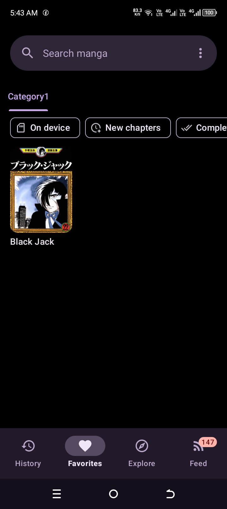
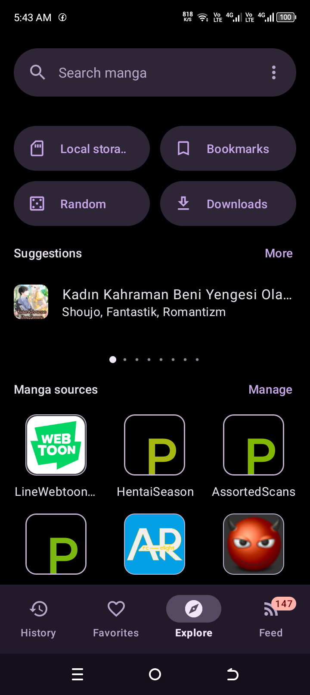
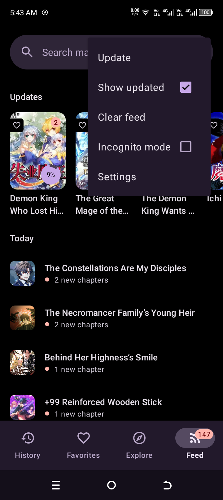
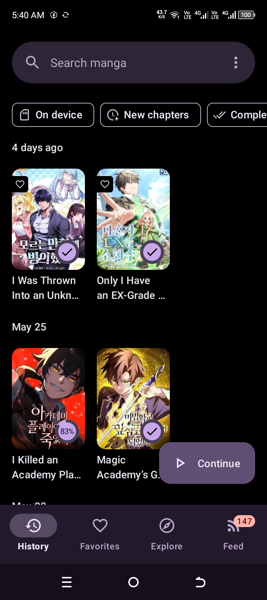
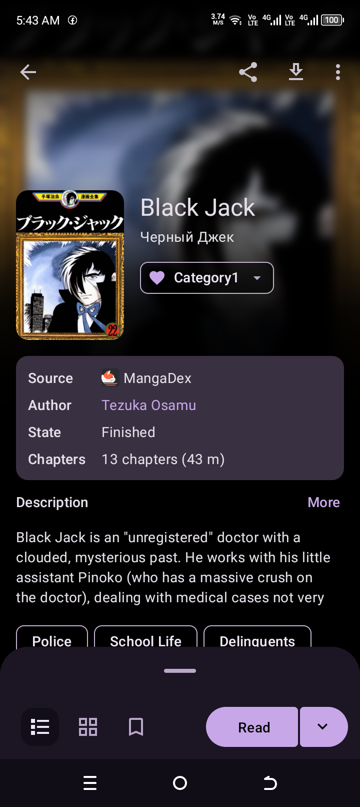

  

  # Miyo

  **A fast, extensible, open-source comic and manga reader for Android.**

  
  
  
  

  [Project Website](https://torro101.github.io/koharu-miyo/)

## Overview

Miyo is an Android comic reader built for large libraries, online sources, and reliable offline reading. It focuses on a clean Material interface, strong source and extension support, stable background downloads, and practical performance on both modern and low-end devices.

Miyo is a rebranded fork and continuation of Usagi, with additional changes, fixes, and native performance work. Usagi itself is derived from Kotatsu, so this project keeps visible credit for both upstream projects and continues under the same open-source license obligations.

The app does not ship copyrighted catalogs or hosted content. Sources, plugins, and local files are controlled by the user, and users are responsible for following the rules of the services and files they access.

## Screenshots

| Library | Explore | Feed |
|----------|----------|----------|
|  |  |  |

| History | Book Details |
|----------|----------|
|  |  |

## Design

Miyo uses the **Ember** design language: a unified warm palette that stays consistent between light and dark themes, Material 3 styling with rounded surfaces and tonal highlights, and redesigned library, details, and reader layouts. Empty, loading, and error states are styled as first-class citizens so the app feels finished at every step, not only on the happy path.

## Features

**Reading**
- Paged, continuous, and webtoon-friendly layouts with gestures, bookmarks, history, and deep reader customization.
- Page trimming, preview loading, cache reuse, and image request headers tuned for manga sources.
- Downloaded and cached pages can be read offline.
- Incognito reading and per-title reading state.
- Share and save page actions from the reader.

**Library**
- Favorites, custom categories, reading status, and update checks for new chapters.
- Local manga directories and CBZ archive parsing.
- Backup and restore of app data.

**Sources and extensions**
- Browse, search, filter, and organize manga from supported sources and local archives.
- Install and manage source plugins, including external GitHub-hosted plugins.
- Keiyoushi/Tachiyomi extension repository support: register an extension index or `repo.json` URL and install individual extensions on demand, without bulk downloads.

**Downloads**
- Save chapters for offline reading as directories or CBZ archives.
- Adaptive parallelism picks safer defaults on low-end devices and stronger concurrency on capable hardware.
- Smart queue orchestration spreads downloads across sources to reduce source-specific stalls.
- Clear, actionable download diagnostics for stalls, retries, and rate limits.
- Optional page refinement with bundled RealESRGAN profiles, originals kept as fallback.

**Privacy and security**
- Password and biometric app lock.
- Incognito reading mode.
- Local-first data: history, favorites, and settings stay on the device unless you configure sync or tracking services.

## Performance

Miyo uses a mix of Kotlin and native C++ helpers where native work provides practical value:

- Native image metadata probing for fast MIME, width, height, and corruption checks.
- Native CBZ/ZIP writing for lower-overhead archive generation during downloads.
- Reader memory governance that estimates decoded page size and reduces prefetch pressure on very large images.
- Adaptive preload limits that respect power-save mode, available RAM, and recent page size.
- Cover caching and reader task cleanup to reduce repeated decoding and stale work.

These optimizations are intentionally conservative: if native helpers are unavailable on a device, the app falls back to the existing Kotlin/JVM path.

## Download

Official builds are distributed through [GitHub Releases](https://github.com/Torro101/MIYO/releases). Android only installs an update over an existing installation when the package name and signing certificate match, so always download from the official release page.

## Building

This project is an Android/Kotlin application with native C++ sources. A normal Android development environment is required:

- JDK 21
- Android SDK (API 36) and NDK with CMake
- Gradle is bundled via the wrapper: `./gradlew assembleDebug`

Release signing should be configured through private local files or encrypted CI secrets. Never commit signing material to the repository. See [CONTRIBUTING.md](CONTRIBUTING.md) for guidelines.

## Contributing

Issues and pull requests are welcome when they are specific, reproducible, and scoped. Good bug reports include the device model, Android version, app version, source or plugin involved, and steps to reproduce. See [CONTRIBUTING.md](CONTRIBUTING.md) for the full guidelines.

## Security and Content Policy

Miyo is a reader application. It does not host, sell, or own third-party content. The maintainers are not affiliated with external content providers or plugins unless explicitly stated.

Report security-sensitive issues privately when possible. Do not open public issues containing tokens, private URLs, account data, or signing material.

## Credits

Miyo is derived from Usagi and carries forward architecture, reader behavior, parser ecosystem ideas, and GPL-licensed work from Kotatsu. This fork adds the Ember design language, Keiyoushi/Tachiyomi extension support, download reliability improvements, native performance helpers, and release infrastructure. Thanks to the Usagi and Kotatsu maintainers, to [YinYang Immortal](https://github.com/immortalyinyang) for code contributions, and to everyone who contributes code, translations, testing, reports, and design feedback.

## License

Miyo is licensed under the [GNU General Public License v3.0](LICENSE). You may use, study, modify, and redistribute the software under the terms of that license.
